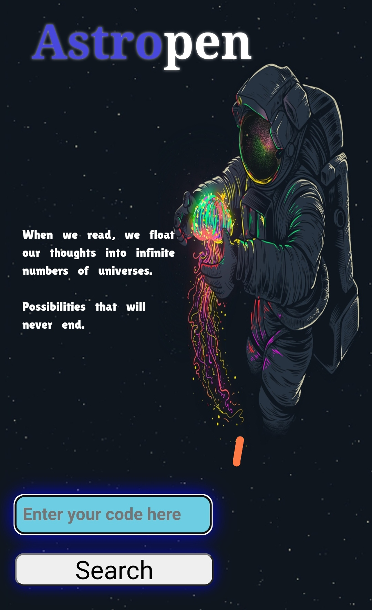
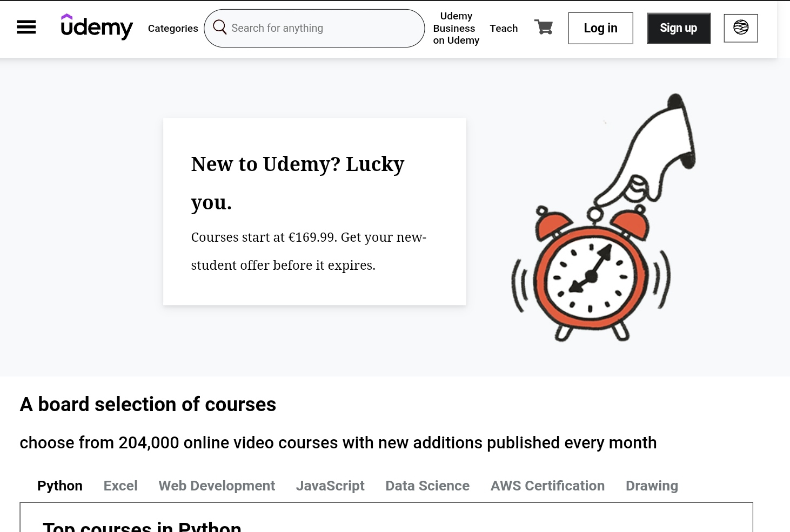
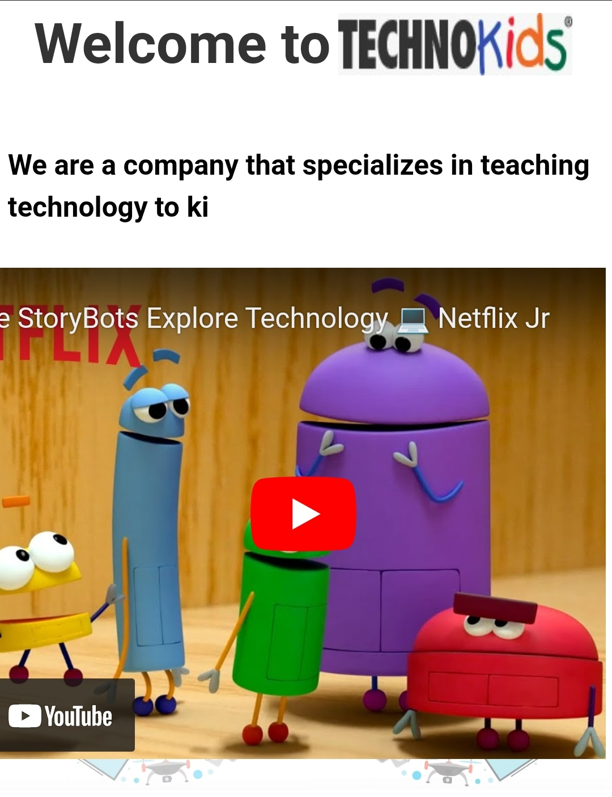
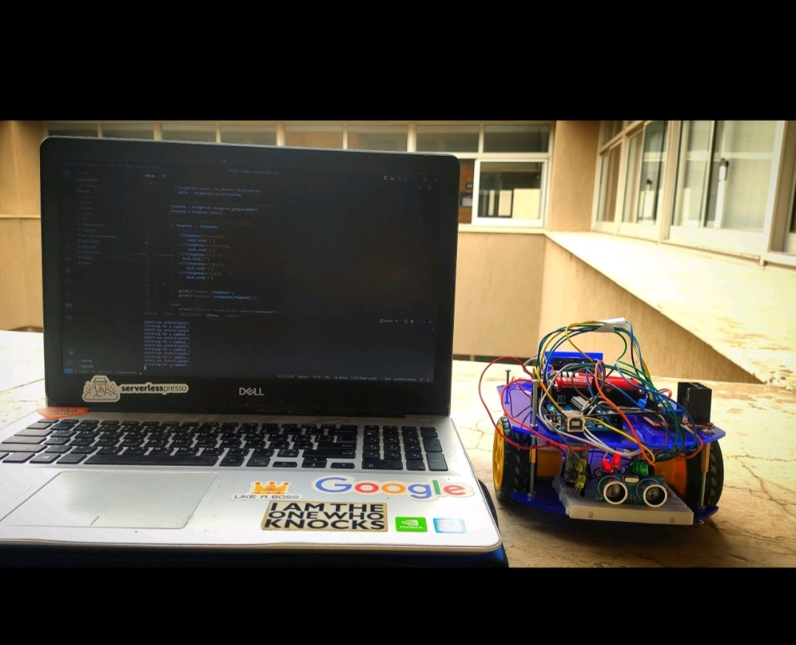
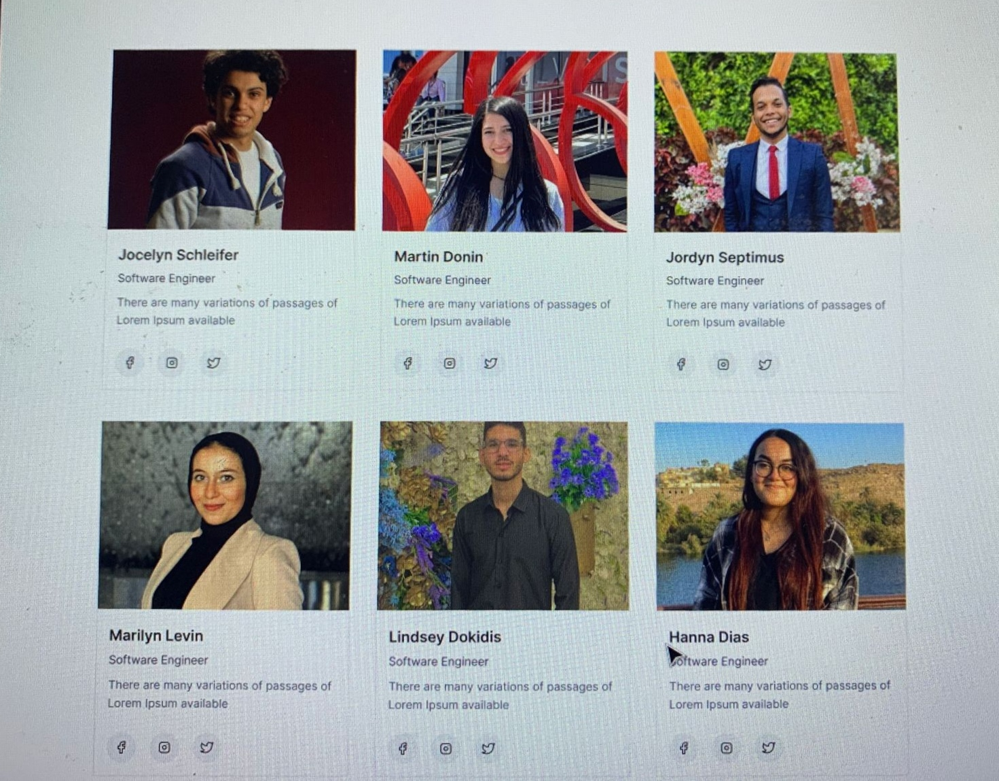
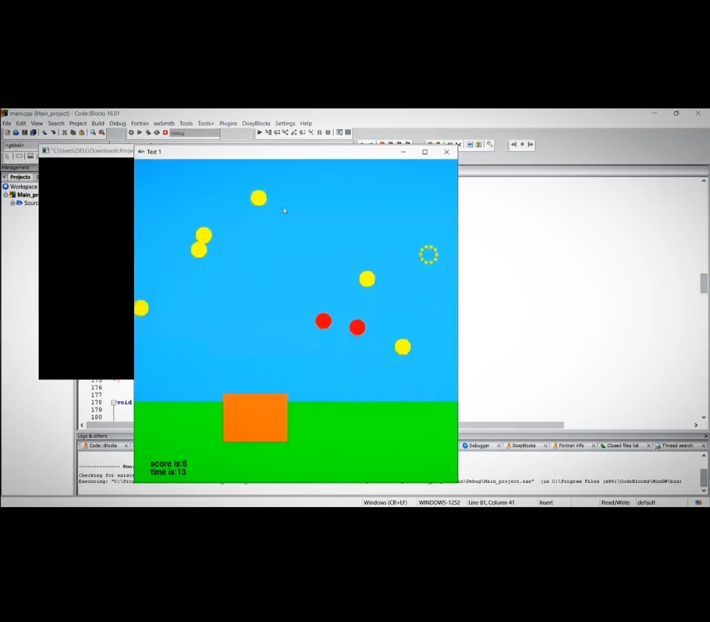

<h2 align="center">Abdelrahman Elzarka 🤖  

</h2>

 
  

  

 

A fresh SW engineer with passion for cloud deployment and full-stack development. Currently working as a cloud engineer <a href="https://www.ejada.com/web/ejada/home">@Ejada</a>.💻  
My technical skills include expertise in Python, C++, React, Nodejs, Django, Angular, Flask, GCP (google cloud platform), AWS (Amazon Web Services), and Docker, enabling me to effectively design and implement full-stack & Devops solutions. I am also passionate about sharing my knowledge and teaching others coding and problem-solving skills.✌️ 
Beyond my technical expertise, I am a highly social person who enjoys attending events related to my field and actively participating in volunteer work. I believe that collaboration and engagement with the wider community are essential for continuous learning and personal growth.🏢

 
<h2 align="left">🛠 Language and tools</h2>

   
  
  
  
  
  
  
  
  
  
  
  
  
  
  
  
  
  
  
  
  
  
  
  
  
  
  
  
  
  
  
  
  
  
  
  
  
  
  
  
  
  
  
  
  

  
  

 
 

<h2 align="left">✨ Take a look on some Projects </h2>

       

  

   

  
         
   
  

###

<h3>☕Get in touch</h3>

  
  

###

