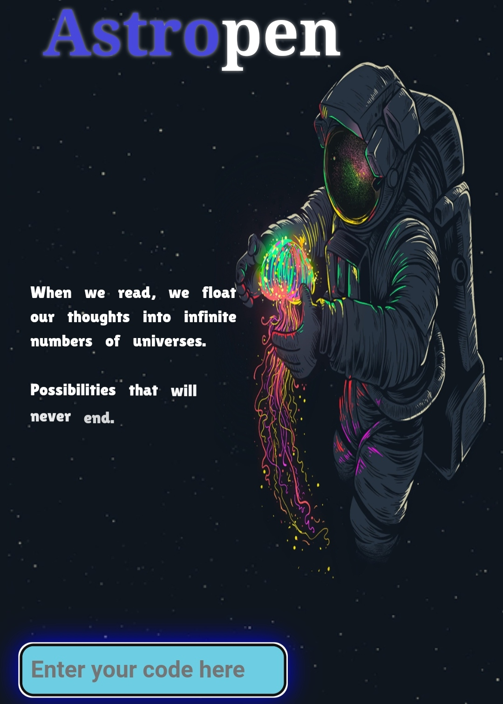

<h2 align="center">Abdelrahman Elzarka 🤖  

</h2>

 
  

  

 

- A fresh SW engineer graduated from <a href="https://aast.edu/en/"> AAST</a>. 🏢
- With passion for cloud deployment, full-stack development and problem solving. 💫
- 2xACPC Finalist. ✌️ 
- Currently working as a cloud engineer <a href="https://www.ejada.com/web/ejada/home">@Ejada</a>.💻
- EX SWE <a href="https://www.valeo.com/en/"> @Valeo</a>.✔️
- Seeking for design full-stack & Devops solutions, and learn new technologies. 💭
- A highly social person who enjoys attending events related to my field and actively participating in volunteer work. 😍

 
<h2 align="left">🛠 Language and tools</h2>

   
  
  
  
  
  
  
  
  
  
  
  
  
  
  
  
  
  
  
  
  
  
  
  
  
  
  
  
  
  
  
  
  
  
  
  
  
  
  
  
  
  
  
  
  

 
 

<h2 align="left">✨ Take a look on some Projects </h2>

       

 
 </a>
         
   

  <a href="https://github.com/Abdelrahmanelzarka/Voice_controlled_car" target="_blank">
    
  
  

###

<h3>☕Get in touch</h3>

 
 
  

###

###  Github state ✅

  
  

